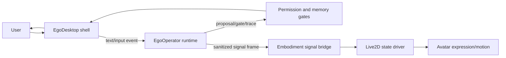

# EgoDesktop Live2D Embodied Companion Architecture Sketch

## Positive Mechanism Goal

Build a future embodied companion layer where EgoOperator can be felt as present through a desktop shell and Live2D avatar: gaze, posture, expression, waiting, attention, emotional timing, and bounded initiative should reflect traceable EgoOperator signals without moving memory, tools, or canonical decisions into the avatar layer.

This is a virtual embodiment architecture sketch. It does not implement a desktop runtime yet.

## Owner Boundary

| surface | canonical owner | EgoDesktop / Live2D role |
| --- | --- | --- |
| user text understanding | `EgoOperator` | render response and presence cues |
| memory/core/candidate state | `EgoOperator` memory gate | read only sanitized signal refs; no writes |
| tools/files/web/commands | `EgoOperator` transaction gate | display pending approval/action state |
| relationship/session context | `EgoOperator` session context | consume short presence hints |
| avatar expression/motion | `EgoDesktop` Live2D driver | map signal frames to expression/motion |
| always-on behavior | future Stage Card + consent gate | no autonomous daemon in this sketch |

EgoDesktop is a presentation and input shell, not a second agent brain.

## Proposed Component Layout



## IPC Contract

v1 should be local-only and narrow:

- Transport: local WebSocket or stdio JSONL; no remote network dependency.
- Direction:
  - `EgoOperator -> EgoDesktop`: sanitized signal frames, reply text, approval state, trace refs.
  - `EgoDesktop -> EgoOperator`: user text/input events only through the same runtime entry path.
- No direct `EgoDesktop -> memory/tool/state` mutation.
- Every signal frame carries a `trace_ref` or `event_id` so UI behavior can be replayed.

Candidate signal schema:

```json
{
  "schema_version": "ego_operator.embodiment_signal.v1",
  "event_id": "uuid-or-trace-id",
  "created_at": "iso8601",
  "source": "ego_operator",
  "reply_text": "bounded visible reply or empty when not speaking",
  "affect_signal": "warm | playful | concerned | focused | quiet | in_scene",
  "relationship_signal": "presence | greeting | roleplay | correction | followup",
  "initiative_signal": "none | proposal_pending | heartbeat_due_candidate",
  "expression_hint": "neutral | soft_smile | attentive | thinking | concern",
  "motion_hint": "idle | nod | lean_in | look_away | wait | greet",
  "consent_state": "foreground_only | pending_approval | quiet_mode",
  "safety_flags": [],
  "trace_ref": "EgoOperator/artifacts/agent_trace.jsonl#event"
}
```

## Live2D State Driver

The Live2D driver should consume signals as hints, not as direct model output:

- `warm/presence` -> soft smile, relaxed idle, slight lean-in.
- `playful` -> brighter eye/mouth expression, small head tilt.
- `concern` -> softer eyes, lower motion amplitude.
- `focused/thinking` -> attentive gaze, subtle wait/think motion.
- `in_scene` -> roleplay-specific expression pack, but no hidden memory write.
- `proposal_pending` -> visible pending approval state, not automatic action.
- `quiet_mode` -> reduced motion and no proactive popups.

The driver should have a deterministic fallback for unknown signals: neutral idle.

## Consent And Always-On Boundary

v1 desktop embodiment must be foreground-first:

- No microphone/camera capture by default.
- No background proactive popup without an approved heartbeat/consent rule.
- A visible pause/quiet toggle is required before any always-on behavior.
- The UI must show when a tool approval, memory write, or heartbeat proposal is pending.
- The avatar cannot claim it executed an action until EgoOperator trace confirms it.

Any always-on daemon, startup registration, microphone input, camera input, or external notification channel requires a separate Stage Card.

## Non-Goals

- Do not implement Live2D runtime in this issue.
- Do not add a second memory store in EgoDesktop.
- Do not let Live2D expressions become canonical emotion state.
- Do not make avatar motion a hidden control loop for tools or memory.
- Do not copy Joi dialogue, likeness, or copyrighted scene text.

## Suggested Implementation Phases

1. `EgoDesktop: local shell and IPC contract`
   - Minimal window, text input/output, local IPC, trace refs.
2. `EgoDesktop: embodiment signal exporter`
   - EgoOperator emits sanitized signal frames after each reply/tool result.
3. `EgoDesktop: Live2D state driver`
   - Deterministic mapping from signal frames to expressions/motions.
4. `EgoDesktop: presence cues pack`
   - Gaze, wait, nod, lean-in, quiet mode, pending approval indicator.
5. `EgoDesktop: always-on consent gate`
   - Separate Stage Card before any background behavior.

## Acceptance Evidence For This Sketch

- Defines IPC, signal inputs, Live2D state driver, consent gate, and non-goals.
- Preserves EgoOperator as the single owner for memory, tools, trace, and state mutation.
- Provides a rollback path: delete this sketch and any future issues derived from it.
- Leaves implementation for future issues with separate Stage Cards where needed.
