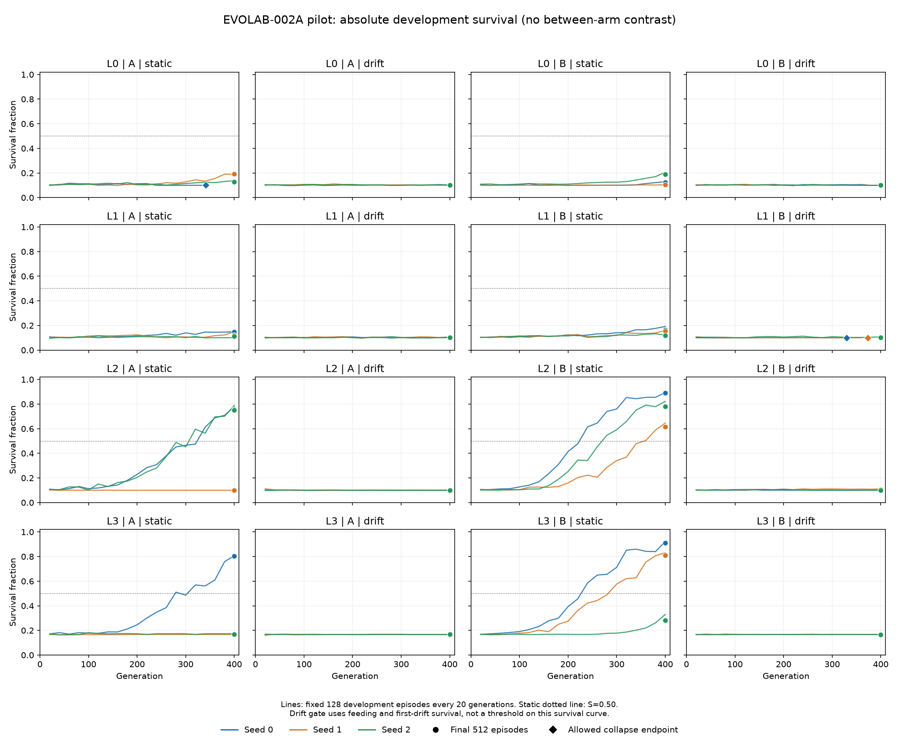
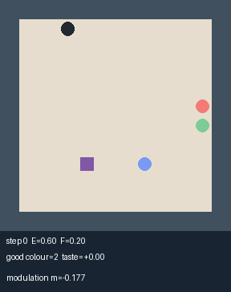

# EVOLAB-002A 报告

执行状态：**STOP_L_EXHAUSTED**。本卡无效：四级固定阶梯均未通过可学性闸门 L。在此预算内 ES 学不会 Room-v0（具体指两臂都达到本卡规定的觅食门槛）；停止，不进入正式实验。V 尚未测量。

**没有形成可塑性正、部分或负结果。** 正式矩阵 F3、正式有效性 V、保留集、B0 消融及 H1–H3 均未验证。当前证据不足以支持或反驳终生可塑性的存活优势，也不能记为 X1 的科学负证据。

F0 已通过；F1 的 W 首次在 poison_cost=0.15 通过；F2 已完成 48 次试跑。F2 累计 GPU 任务墙钟 20744.725 秒（5.7624 小时），上限 21600 秒。此墙钟包含调度、同步、检查点和评估，并非纯 CUDA kernel 时间。

其中 45 次跑满400代，3次按坍缩规则提前结束，共 19044 代。完整关闭摘要见 [closure_summary.json](closure_summary.json)。

## 工程与可复现性

Windows 原生，沿用 .venv、PyTorch 2.11.0+cu128 / CUDA 12.8、sm_120。001A 的回归完整测试集 33/33 通过（42.09秒）；新增闸门测试2项、恢复时间 CPU 单测4项分别通过。详见 [F0](F0_TESTS.md)、[次要分析测试](secondary_tests.json) 和 runs/002A 中对应日志。

新实现位于 evolab/v002/；原世界步进与 OpenES 保持复用。001A 两臂的新进程五代重放逐位一致；两臂各抽取 drift/seed0 第400代均值在原开发集1024回合的结果逐位一致。001A 文件哈希、原 PROGRESS 后缀与任务板非 EVOLAB 行通过保护审计。002A 的整批400代跨进程重复运行未验证。

首轮 F0 曾因共享 checkout 外部快进至 cf3666c、README 新增002A入口导致哈希测试失败；核对外部提交后只更新该保护基准，保留失败记录。未修改001A原代码、冻结配置、预注册或证据。

| protected file | SHA-256 |
|---|---|
| `PREREG_002A.md` | `4d378b0c224550ee3a982f134a313edd341d40da1303e4f88a69cd102fe58a68` |
| `PREREG_E2.md` | `b0b8e3939a3cf22b1fb7071e576cae8aa9ec71d93cc25d33635d131fcc15e082` |
| `configs/e2_frozen.yaml` | `134d90c1d7e935be720d73445784b488818c16744c8d29f98f177c97493e14a8` |

## 配置与选择规则

没有通过 L 的最终采用配置，因此未生成正式冻结配置。开发配置逐级保存为 configs/002a_pilot_L*.yaml；每次运行摘要记录其SHA-256。F1选定毒性0.15（001A为0.05）；L0移动额外耗能0（原0.002）；L1视野7×7（原5×5）；L2 σ=0.05 / population=512（原0.02 / 256）；L3初始能量1.0（原0.6）。仅执行已启动的级，未跳级、未额外改适应度或增加训练手段。

5×5视野时参数 A=18246、B=18254；7×7时 A=25926、B=25934。两种尺寸均通过参数预算匹配测试。所有试跑使用 master_seed=20261002 和独立 pilot 域，正式 master_seed=20261003 尚未使用。保留集入口仍被代码拒绝。

每个完整运行只取第400代均值；允许的连续20代零方差坍缩试跑取检测时刻均值。没有按中途最高分选择，未用 B−A 差值决定阶梯。完整运行记录、坍缩和错误见下文。

## 计时、热状态与偏离

完整预算探针为预先指定的 L0 B/drift/seed0：285.397秒。按各级种群倍数外推四级约5.708小时；实际总耗时比该粗估高 0.95%。该模型没有单独建模视野、存活长度和热状态；各次实测耗时见完整表格。

F2中一次 nvidia-smi 明确记录 SW Thermal Slowdown Active；插电状态已只读核实。温度/时钟范围见下文，均为采样值，不代表连续峰值；驱动累计降频计数不能全部归因于本实验。未改变功耗或系统设置。

固定示例 GIF 的512回合重放耗时91.215秒，与 L0 B/static/seed2 末段并行，占用已纳入F2墙钟；该训练运行耗时不作为独立吞吐基准。以后未再并行启动GPU辅助工作。GIF重放逐回合分数与原保存结果逐位一致。

## 世界闸门完整数值

以下保留F1完成时的阶段记录；其中后续计划反映当时状态。已实施的F2结果见下一节。

结论：PASS，首个通过毒性为 0.15。累计GPU任务墙钟 63.344 秒（含同步、CPU调度、存盘），无训练。

| poison_cost | drift H | drift N | drift F | static H | W |
|---|---:|---:|---:|---:|---|
| 0.05 | 1.000000000 | 0.999345703 | 0.141826823 | 1.000000000 | False |
| 0.1 | 1.000000000 | 0.569022135 | 0.124917969 | 1.000000000 | False |
| 0.15 | 1.000000000 | 0.204498698 | 0.112719401 | 1.000000000 | True |

温度采样 58–83°C，图形时钟 382–2722MHz；每个基线评估后采样，不能推断连续峰值。

每个条件1024回合。F1独立域410000、master_seed=20261002、run_seed=0，各毒性使用相同随机输入；move_cost=0、视野5、初始能量0.6，其余沿用001A。完整检查布尔值、进食/恢复/漂移暴露和温度在 `f1_world_gate.json`，每回合原始张量在 `runs/002A/F1/`。

0.05和0.10均因N超过H的一半而失败；0.15四项全部通过，按规则不再试0.20/0.30。不跳级、不择优、不改脚本。无运行崩溃或NaN，无保留集访问。

此结果只证明该参数下脚本H优于这两个固定脚本对照，不证明所有不适应策略都无法生存，也不证明演化能学会觅食或可塑性有效。L、V和科学判定均未验证。下一步F2按L0→L3，累计6 GPU任务小时预算。

## 可学性闸门完整数值

状态：STOP_L_EXHAUSTED；选定级：None。

累计GPU任务墙钟 20744.725 秒（含CPU调度、CUDA同步、检查点、评估和重测W）。预算21600秒。

完整400代预跑：285.3970934999961 秒；四级规模规划估计：20548.59073199972 秒。

固定毒性0.15。L0移动额外耗能0；L1累加7×7视野；L2累加σ=0.05、种群512；L3累加初始能量1.0。每级2臂×2世界×3种子，最终512个pilot开发回合。

域pilot_train=420000、pilot_dev=430000，master_seed=20261002。两臂配对种子0–2，初始化与突变也含pilot域。每20代128固定开发回合仅用于日志；最终512回合generation标签1，与中途标签0隔离。没有保留集访问。

首轮B/drift/seed0预先指定跑满400代实测；其他试跑在连续20代零标准差时允许提前结束并取该时刻均值。collapsed_at为第20代检测时刻。未用最佳检查点。标准差以float64计算，避免常数float32向量因归约舍入出现伪非零。适应度、OpenES秩和Adam均沿用001A。

### L0

配置：`configs/002a_pilot_L0.yaml`。

| arm | world | seed | generations | collapsed_at | S | ate good ≥1 | survived first | good/bad mean | seconds |
|---|---|---:|---:|---:|---:|---:|---:|---|---:|
| gru_mb_plastic | drift | 0 | 400 | None | 0.105351562 | 0.121093750 | 0.042968750 | 0.269531/0.347656 | 285.397 |
| gru_fixed | static | 0 | 341 | 341 | 0.101710938 | 0.003906250 | 0.000000000 | 0.076172/0.005859 | 68.609 |
| gru_fixed | static | 1 | 400 | None | 0.192437500 | 0.455078125 | 0.000000000 | 2.427734/0.619141 | 212.558 |
| gru_fixed | static | 2 | 400 | None | 0.127958333 | 0.261718750 | 0.000000000 | 0.765625/0.353516 | 178.515 |
| gru_fixed | drift | 0 | 400 | None | 0.101713542 | 0.050781250 | 0.025390625 | 0.148438/0.169922 | 109.326 |
| gru_fixed | drift | 1 | 400 | None | 0.100186198 | 0.003906250 | 0.003906250 | 0.011719/0.017578 | 94.759 |
| gru_fixed | drift | 2 | 400 | None | 0.101450521 | 0.027343750 | 0.009765625 | 0.058594/0.060547 | 101.503 |
| gru_mb_plastic | static | 0 | 400 | None | 0.123075521 | 0.263671875 | 0.000000000 | 0.615234/0.298828 | 232.658 |
| gru_mb_plastic | static | 1 | 400 | None | 0.104617188 | 0.078125000 | 0.000000000 | 0.160156/0.072266 | 261.189 |
| gru_mb_plastic | static | 2 | 400 | None | 0.188792969 | 0.519531250 | 0.000000000 | 2.107422/0.443359 | 677.485 |
| gru_mb_plastic | drift | 1 | 400 | None | 0.100052083 | 0.003906250 | 0.000000000 | 0.005859/0.009766 | 275.254 |
| gru_mb_plastic | drift | 2 | 400 | None | 0.101894531 | 0.027343750 | 0.013671875 | 0.093750/0.050781 | 275.037 |

| arm | world | seed-average S | ate good ≥1 | survived first | absolute gate |
|---|---|---:|---:|---:|---|
| gru_fixed | static | 0.140702257 | 0.240234375 | 0.000000000 | {'complete': True, 'ate_good': False, 'survival': False} |
| gru_fixed | drift | 0.101116753 | 0.027343750 | 0.013020833 | {'complete': True, 'ate_good': False, 'survived_first': False} |
| gru_mb_plastic | static | 0.138828559 | 0.287109375 | 0.000000000 | {'complete': True, 'ate_good': False, 'survival': False} |
| gru_mb_plastic | drift | 0.102432726 | 0.050781250 | 0.018880208 | {'complete': True, 'ate_good': False, 'survived_first': False} |

L0通过：False。

W沿用F1：L0世界一致，L1视野和L2 ES改动不影响拥有全坐标的脚本基线，轨迹不变。

### L1

配置：`configs/002a_pilot_L1.yaml`。

| arm | world | seed | generations | collapsed_at | S | ate good ≥1 | survived first | good/bad mean | seconds |
|---|---|---:|---:|---:|---:|---:|---:|---|---:|
| gru_mb_plastic | drift | 0 | 330 | 330 | 0.100098958 | 0.003906250 | 0.000000000 | 0.003906/0.003906 | 109.961 |
| gru_fixed | static | 0 | 400 | None | 0.148946615 | 0.320312500 | 0.000000000 | 1.265625/0.462891 | 211.261 |
| gru_fixed | static | 1 | 400 | None | 0.120638021 | 0.179687500 | 0.000000000 | 0.683594/0.363281 | 203.858 |
| gru_fixed | static | 2 | 400 | None | 0.111091146 | 0.085937500 | 0.000000000 | 0.369141/0.189453 | 159.397 |
| gru_fixed | drift | 0 | 400 | None | 0.100372396 | 0.056640625 | 0.021484375 | 0.119141/0.250000 | 128.498 |
| gru_fixed | drift | 1 | 400 | None | 0.101936198 | 0.058593750 | 0.019531250 | 0.125000/0.181641 | 128.984 |
| gru_fixed | drift | 2 | 400 | None | 0.101936198 | 0.025390625 | 0.011718750 | 0.076172/0.066406 | 101.126 |
| gru_mb_plastic | static | 0 | 400 | None | 0.163520833 | 0.324218750 | 0.000000000 | 1.623047/0.359375 | 424.400 |
| gru_mb_plastic | static | 1 | 400 | None | 0.154602865 | 0.326171875 | 0.000000000 | 1.431641/0.296875 | 415.369 |
| gru_mb_plastic | static | 2 | 400 | None | 0.117373698 | 0.265625000 | 0.000000000 | 0.517578/0.371094 | 377.832 |
| gru_mb_plastic | drift | 1 | 373 | 373 | 0.100147135 | 0.003906250 | 0.000000000 | 0.003906/0.001953 | 125.057 |
| gru_mb_plastic | drift | 2 | 400 | None | 0.102315104 | 0.054687500 | 0.027343750 | 0.136719/0.191406 | 221.832 |

| arm | world | seed-average S | ate good ≥1 | survived first | absolute gate |
|---|---|---:|---:|---:|---|
| gru_fixed | static | 0.126891927 | 0.195312500 | 0.000000000 | {'complete': True, 'ate_good': False, 'survival': False} |
| gru_fixed | drift | 0.101414931 | 0.046875000 | 0.017578125 | {'complete': True, 'ate_good': False, 'survived_first': False} |
| gru_mb_plastic | static | 0.145165799 | 0.305338542 | 0.000000000 | {'complete': True, 'ate_good': False, 'survival': False} |
| gru_mb_plastic | drift | 0.100853733 | 0.020833333 | 0.009114583 | {'complete': True, 'ate_good': False, 'survived_first': False} |

L1通过：False。

W沿用F1：L0世界一致，L1视野和L2 ES改动不影响拥有全坐标的脚本基线，轨迹不变。

### L2

配置：`configs/002a_pilot_L2.yaml`。

| arm | world | seed | generations | collapsed_at | S | ate good ≥1 | survived first | good/bad mean | seconds |
|---|---|---:|---:|---:|---:|---:|---:|---|---:|
| gru_mb_plastic | drift | 0 | 400 | None | 0.100069010 | 0.007812500 | 0.003906250 | 0.011719/0.021484 | 339.376 |
| gru_fixed | static | 0 | 400 | None | 0.757300781 | 0.964843750 | 0.000000000 | 21.582031/1.009766 | 1035.514 |
| gru_fixed | static | 1 | 400 | None | 0.100097656 | 0.001953125 | 0.000000000 | 0.001953/0.000000 | 278.287 |
| gru_fixed | static | 2 | 400 | None | 0.751404948 | 0.943359375 | 0.000000000 | 20.753906/1.033203 | 993.616 |
| gru_fixed | drift | 0 | 400 | None | 0.099903646 | 0.000000000 | 0.000000000 | 0.000000/0.003906 | 249.735 |
| gru_fixed | drift | 1 | 400 | None | 0.100000000 | 0.000000000 | 0.000000000 | 0.000000/0.000000 | 226.168 |
| gru_fixed | drift | 2 | 400 | None | 0.099903646 | 0.000000000 | 0.000000000 | 0.000000/0.003906 | 290.657 |
| gru_mb_plastic | static | 0 | 400 | None | 0.891315104 | 0.982421875 | 0.000000000 | 26.583984/1.501953 | 2196.596 |
| gru_mb_plastic | static | 1 | 400 | None | 0.613990885 | 0.865234375 | 0.000000000 | 16.699219/0.847656 | 1334.279 |
| gru_mb_plastic | static | 2 | 400 | None | 0.779908854 | 0.923828125 | 0.000000000 | 21.042969/1.132812 | 1444.108 |
| gru_mb_plastic | drift | 1 | 400 | None | 0.105119792 | 0.068359375 | 0.050781250 | 0.226562/0.261719 | 520.584 |
| gru_mb_plastic | drift | 2 | 400 | None | 0.100049479 | 0.001953125 | 0.000000000 | 0.001953/0.001953 | 406.774 |

| arm | world | seed-average S | ate good ≥1 | survived first | absolute gate |
|---|---|---:|---:|---:|---|
| gru_fixed | static | 0.536267795 | 0.636718750 | 0.000000000 | {'complete': True, 'ate_good': False, 'survival': True} |
| gru_fixed | drift | 0.099935764 | 0.000000000 | 0.000000000 | {'complete': True, 'ate_good': False, 'survived_first': False} |
| gru_mb_plastic | static | 0.761738281 | 0.923828125 | 0.000000000 | {'complete': True, 'ate_good': True, 'survival': True} |
| gru_mb_plastic | drift | 0.101746094 | 0.026041667 | 0.018229167 | {'complete': True, 'ate_good': False, 'survived_first': False} |

L2通过：False。

W沿用F1：L0世界一致，L1视野和L2 ES改动不影响拥有全坐标的脚本基线，轨迹不变。

### L3

配置：`configs/002a_pilot_L3.yaml`。

| arm | world | seed | generations | collapsed_at | S | ate good ≥1 | survived first | good/bad mean | seconds |
|---|---|---:|---:|---:|---:|---:|---:|---|---:|
| gru_mb_plastic | drift | 0 | 400 | None | 0.166937500 | 0.009765625 | 0.250000000 | 0.013672/0.025391 | 426.327 |
| gru_fixed | static | 0 | 400 | None | 0.803468750 | 0.962890625 | 0.000000000 | 22.728516/1.109375 | 610.920 |
| gru_fixed | static | 1 | 400 | None | 0.166968750 | 0.007812500 | 0.000000000 | 0.011719/0.013672 | 192.575 |
| gru_fixed | static | 2 | 400 | None | 0.169488281 | 0.005859375 | 0.000000000 | 0.125000/0.025391 | 266.696 |
| gru_fixed | drift | 0 | 400 | None | 0.166695312 | 0.007812500 | 0.244140625 | 0.007812/0.023438 | 138.705 |
| gru_fixed | drift | 1 | 400 | None | 0.167121094 | 0.011718750 | 0.242187500 | 0.021484/0.033203 | 139.887 |
| gru_fixed | drift | 2 | 400 | None | 0.167199219 | 0.013671875 | 0.187500000 | 0.021484/0.025391 | 171.063 |
| gru_mb_plastic | static | 0 | 400 | None | 0.909300781 | 0.996093750 | 0.000000000 | 26.294922/1.119141 | 1146.882 |
| gru_mb_plastic | static | 1 | 400 | None | 0.810954427 | 0.964843750 | 0.000000000 | 21.574219/1.146484 | 1249.665 |
| gru_mb_plastic | static | 2 | 400 | None | 0.282763021 | 0.437500000 | 0.000000000 | 3.558594/0.408203 | 750.666 |
| gru_mb_plastic | drift | 1 | 400 | None | 0.166877604 | 0.013671875 | 0.238281250 | 0.013672/0.027344 | 455.471 |
| gru_mb_plastic | drift | 2 | 400 | None | 0.166785156 | 0.013671875 | 0.185546875 | 0.015625/0.025391 | 458.415 |

| arm | world | seed-average S | ate good ≥1 | survived first | absolute gate |
|---|---|---:|---:|---:|---|
| gru_fixed | static | 0.379975260 | 0.325520833 | 0.000000000 | {'complete': True, 'ate_good': False, 'survival': False} |
| gru_fixed | drift | 0.167005208 | 0.011067708 | 0.224609375 | {'complete': True, 'ate_good': False, 'survived_first': False} |
| gru_mb_plastic | static | 0.667672743 | 0.799479167 | 0.000000000 | {'complete': True, 'ate_good': False, 'survival': True} |
| gru_mb_plastic | drift | 0.166866753 | 0.012369792 | 0.224609375 | {'complete': True, 'ate_good': False, 'survived_first': False} |

L3通过：False。

W重测通过：True；各条件：[('drift', 'H', 1.0), ('drift', 'N', 0.31878580729166667), ('drift', 'F', 0.15108919270833332), ('static', 'H', 1.0)]

逐20代及运行首尾采样温度70–92°C，图形时钟1177–2670MHz；非连续峰值。

### 失败、预算与偏离

截至该报告，没有运行NaN、崩溃或失败重跑。

逐代原始日志、检查点与逐回合指标保留在 `runs/002A/F2/`；提交的 `pilot_summaries/` 只含固定每20代摘要及最后指标。完整阶段索引 `f2_learnability.json`。

只按上述绝对指标选择阶梯，没有查看B−A差值，没有增加阶梯之外的训练手段。正式矩阵、V、保留集、消融和H1–H3均未验证。

## 次要分析

只描述已有pilot开发回合，不是保留集或消融分析。每个种子独立统计；从未经历切换记为no_switches，中位数未降到50%记为not_reached。死亡、时限或下一次切换使未恢复事件右截尾。同一步切换并吃到好食物记0步；同一时刻的恢复先于截尾移出风险集。

采用 [NIST所述的Kaplan–Meier乘积极限估计](https://itl.nist.gov/div898/handbook/apr/section2/apr215.htm)。死亡/下一次切换可能构成信息性截尾，因此只作描述，不推断死亡后的反事实恢复，不参与任何闸门或H1–H3判定。

| level | arm | world | seed | good mean | bad mean | switches | censored | censor fraction | KM median steps | status | collapsed_at |
|---|---|---|---:|---:|---:|---:|---:|---:|---:|---|---:|
| L0 | gru_mb_plastic | drift | 0 | 0.269531 | 0.347656 | 22 | 21 | 0.954545 | N/A | not_reached | None |
| L0 | gru_fixed | static | 0 | 0.076172 | 0.005859 | 0 | 0 | N/A | N/A | no_switches | 341 |
| L0 | gru_fixed | static | 1 | 2.427734 | 0.619141 | 0 | 0 | N/A | N/A | no_switches | None |
| L0 | gru_fixed | static | 2 | 0.765625 | 0.353516 | 0 | 0 | N/A | N/A | no_switches | None |
| L0 | gru_fixed | drift | 0 | 0.148438 | 0.169922 | 14 | 13 | 0.928571 | N/A | not_reached | None |
| L0 | gru_fixed | drift | 1 | 0.011719 | 0.017578 | 2 | 2 | 1.000000 | N/A | not_reached | None |
| L0 | gru_fixed | drift | 2 | 0.058594 | 0.060547 | 5 | 5 | 1.000000 | N/A | not_reached | None |
| L0 | gru_mb_plastic | static | 0 | 0.615234 | 0.298828 | 0 | 0 | N/A | N/A | no_switches | None |
| L0 | gru_mb_plastic | static | 1 | 0.160156 | 0.072266 | 0 | 0 | N/A | N/A | no_switches | None |
| L0 | gru_mb_plastic | static | 2 | 2.107422 | 0.443359 | 0 | 0 | N/A | N/A | no_switches | None |
| L0 | gru_mb_plastic | drift | 1 | 0.005859 | 0.009766 | 0 | 0 | N/A | N/A | no_switches | None |
| L0 | gru_mb_plastic | drift | 2 | 0.093750 | 0.050781 | 7 | 7 | 1.000000 | N/A | not_reached | None |
| L1 | gru_mb_plastic | drift | 0 | 0.003906 | 0.003906 | 0 | 0 | N/A | N/A | no_switches | 330 |
| L1 | gru_fixed | static | 0 | 1.265625 | 0.462891 | 0 | 0 | N/A | N/A | no_switches | None |
| L1 | gru_fixed | static | 1 | 0.683594 | 0.363281 | 0 | 0 | N/A | N/A | no_switches | None |
| L1 | gru_fixed | static | 2 | 0.369141 | 0.189453 | 0 | 0 | N/A | N/A | no_switches | None |
| L1 | gru_fixed | drift | 0 | 0.119141 | 0.250000 | 11 | 10 | 0.909091 | N/A | not_reached | None |
| L1 | gru_fixed | drift | 1 | 0.125000 | 0.181641 | 11 | 9 | 0.818182 | 181 | reached | None |
| L1 | gru_fixed | drift | 2 | 0.076172 | 0.066406 | 6 | 6 | 1.000000 | N/A | not_reached | None |
| L1 | gru_mb_plastic | static | 0 | 1.623047 | 0.359375 | 0 | 0 | N/A | N/A | no_switches | None |
| L1 | gru_mb_plastic | static | 1 | 1.431641 | 0.296875 | 0 | 0 | N/A | N/A | no_switches | None |
| L1 | gru_mb_plastic | static | 2 | 0.517578 | 0.371094 | 0 | 0 | N/A | N/A | no_switches | None |
| L1 | gru_mb_plastic | drift | 1 | 0.003906 | 0.001953 | 0 | 0 | N/A | N/A | no_switches | 373 |
| L1 | gru_mb_plastic | drift | 2 | 0.136719 | 0.191406 | 14 | 13 | 0.928571 | N/A | not_reached | None |
| L2 | gru_mb_plastic | drift | 0 | 0.011719 | 0.021484 | 2 | 2 | 1.000000 | N/A | not_reached | None |
| L2 | gru_fixed | static | 0 | 21.582031 | 1.009766 | 0 | 0 | N/A | N/A | no_switches | None |
| L2 | gru_fixed | static | 1 | 0.001953 | 0.000000 | 0 | 0 | N/A | N/A | no_switches | None |
| L2 | gru_fixed | static | 2 | 20.753906 | 1.033203 | 0 | 0 | N/A | N/A | no_switches | None |
| L2 | gru_fixed | drift | 0 | 0.000000 | 0.003906 | 0 | 0 | N/A | N/A | no_switches | None |
| L2 | gru_fixed | drift | 1 | 0.000000 | 0.000000 | 0 | 0 | N/A | N/A | no_switches | None |
| L2 | gru_fixed | drift | 2 | 0.000000 | 0.003906 | 0 | 0 | N/A | N/A | no_switches | None |
| L2 | gru_mb_plastic | static | 0 | 26.583984 | 1.501953 | 0 | 0 | N/A | N/A | no_switches | None |
| L2 | gru_mb_plastic | static | 1 | 16.699219 | 0.847656 | 0 | 0 | N/A | N/A | no_switches | None |
| L2 | gru_mb_plastic | static | 2 | 21.042969 | 1.132812 | 0 | 0 | N/A | N/A | no_switches | None |
| L2 | gru_mb_plastic | drift | 1 | 0.226562 | 0.261719 | 27 | 26 | 0.962963 | N/A | not_reached | None |
| L2 | gru_mb_plastic | drift | 2 | 0.001953 | 0.001953 | 0 | 0 | N/A | N/A | no_switches | None |
| L3 | gru_mb_plastic | drift | 0 | 0.013672 | 0.025391 | 135 | 134 | 0.992593 | N/A | not_reached | None |
| L3 | gru_fixed | static | 0 | 22.728516 | 1.109375 | 0 | 0 | N/A | N/A | no_switches | None |
| L3 | gru_fixed | static | 1 | 0.011719 | 0.013672 | 0 | 0 | N/A | N/A | no_switches | None |
| L3 | gru_fixed | static | 2 | 0.125000 | 0.025391 | 0 | 0 | N/A | N/A | no_switches | None |
| L3 | gru_fixed | drift | 0 | 0.007812 | 0.023438 | 132 | 132 | 1.000000 | N/A | not_reached | None |
| L3 | gru_fixed | drift | 1 | 0.021484 | 0.033203 | 125 | 125 | 1.000000 | N/A | not_reached | None |
| L3 | gru_fixed | drift | 2 | 0.021484 | 0.025391 | 99 | 99 | 1.000000 | N/A | not_reached | None |
| L3 | gru_mb_plastic | static | 0 | 26.294922 | 1.119141 | 0 | 0 | N/A | N/A | no_switches | None |
| L3 | gru_mb_plastic | static | 1 | 21.574219 | 1.146484 | 0 | 0 | N/A | N/A | no_switches | None |
| L3 | gru_mb_plastic | static | 2 | 3.558594 | 0.408203 | 0 | 0 | N/A | N/A | no_switches | None |
| L3 | gru_mb_plastic | drift | 1 | 0.013672 | 0.027344 | 123 | 123 | 1.000000 | N/A | not_reached | None |
| L3 | gru_mb_plastic | drift | 2 | 0.015625 | 0.025391 | 98 | 98 | 1.000000 | N/A | not_reached | None |

## 可视证据

曲线为固定128开发回合的每20代记录，最终点为512独立标签开发回合。显示各自的绝对存活比例；闸门同时检查进食和第一次漂移暴露，曲线本身不能替代闸门。

GIF固定取 L0 B/drift/seed0 最终均值、开发回合0，没有按表现挑选。该回合存活300步、吃到2次好食物、0次坏食物，死亡前未经历漂移，因此不展示漂移后的适应。代理已检查画面和标注；用户人工目检未验证。

## 本结果不能证明什么

W只说明特权手写H与本卡规定的N/F对照满足数值要求，不能排除所有其他不适应策略。试跑失败只限制本卡世界、网络、OpenES及预算组合，不能推出演化策略普遍不可行，也不能推出可塑性无效。

没有正式开发V结果、保留集效应量或置信区间，没有B0消融。不得把个别static成功种子、进食或GIF作为科学假设的证据；不得外推到桌宠或用户，不作生命、意识、情感或能动性声明。

原始逐代日志、均值、优化器检查点和逐回合张量保留于 runs/002A/（不提交）；提交摘要JSON、报告与图像。证据一致性见 [integrity_audit.json](integrity_audit.json)。停止后的进一步训练或新方法须由用户决定。
