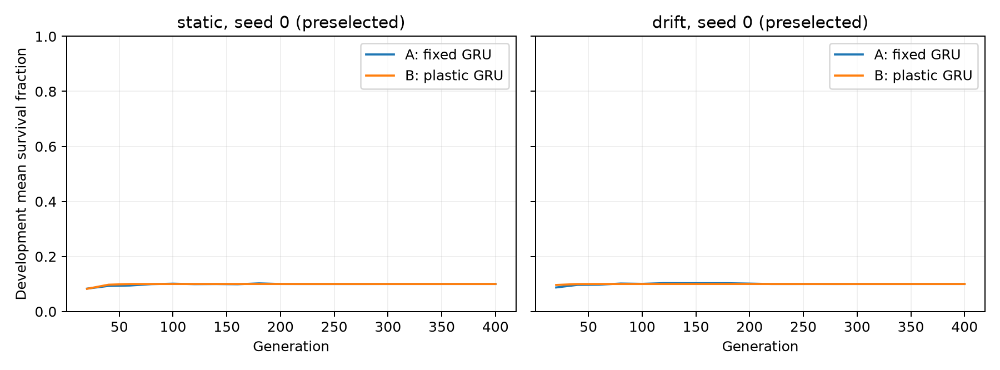
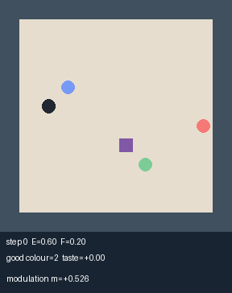

# EVOLAB-001A E2 报告

负结果：在这个规模下，演化出的可塑性没有超过循环网络的上下文内适应。不重调、不追加救援实验。

**执行完成：20次×400代；训练与评估合计28.41分钟；无训练失败重跑。** 本文S是存活步数除以1500的均值，不是活满回合的概率。

**主要局限：漂移训练后的独立开发回合中，A/B有99.902%/99.961%在200步前死亡，而训练首次漂移在200–400步。** 本轮对持续适应的覆盖有限；注册判负不等于可塑性一般无效，也不证明A实际形成了上下文适应能力。完整分布与解释见后文。

H1=False，H2=None（H1不成立时不适用），H3=True。

配置SHA-256：`134d90c1d7e935be720d73445784b488818c16744c8d29f98f177c97493e14a8`。训练选择严格为第400代均值，20次完整运行通过工程门槛。

- drift_B_minus_A: {'difference': -2.7734371542464942e-05, 'ci95': [-0.00011419270376791246, 1.5494797844439744e-05], 'bootstrap_replicates': 10000, 'seed_pairs_positive': 2}
- drift_B_minus_B0: {'difference': -4.388016532175243e-05, 'ci95': [-0.00019805008847470162, 2.910160515966709e-05], 'bootstrap_replicates': 10000, 'seed_pairs_positive': 4}
- static_B_minus_A: {'difference': -2.057291130768135e-05, 'ci95': [-0.00019115559683996252, 0.00017305014327575913], 'bootstrap_replicates': 10000, 'seed_pairs_positive': 3}

|训练世界|臂|种子|条件|平均存活|回合bootstrap 95% CI|
|---|---|---|---|---|---|
|static|gru_fixed|0|static_holdout|0.099992|[0.09997461085004034, 0.10000000149011612]|
|static|gru_fixed|0|drift_fast|0.099992|[0.09997461085004034, 0.10000000149011612]|
|static|gru_fixed|0|drift_slow|0.099992|[0.09997461085004034, 0.10000000149011612]|
|static|gru_fixed|1|static_holdout|0.099992|[0.09997461085004034, 0.10000000149011612]|
|static|gru_fixed|1|drift_fast|0.099992|[0.09997461085004034, 0.10000000149011612]|
|static|gru_fixed|1|drift_slow|0.099992|[0.09997461085004034, 0.10000000149011612]|
|static|gru_fixed|2|static_holdout|0.099999|[0.09999674626305932, 0.10000000149011612]|
|static|gru_fixed|2|drift_fast|0.099999|[0.09999674626305932, 0.10000000149011612]|
|static|gru_fixed|2|drift_slow|0.099999|[0.09999674626305932, 0.10000000149011612]|
|static|gru_fixed|3|static_holdout|0.100152|[0.10000000149011612, 0.10045507961331168]|
|static|gru_fixed|3|drift_fast|0.099959|[0.0998769546058611, 0.10000000149011612]|
|static|gru_fixed|3|drift_slow|0.099959|[0.0998769546058611, 0.10000000149011612]|
|static|gru_fixed|4|static_holdout|0.100088|[0.0998437514717807, 0.1004856785730226]|
|static|gru_fixed|4|drift_fast|0.100040|[0.0998437514717807, 0.10034244937560288]|
|static|gru_fixed|4|drift_slow|0.100060|[0.0998437514717807, 0.10040104312793119]|
|static|gru_mb_plastic|0|static_holdout|0.100000|[0.10000000149011612, 0.10000000149011612]|
|static|gru_mb_plastic|0|drift_fast|0.100000|[0.10000000149011612, 0.10000000149011612]|
|static|gru_mb_plastic|0|drift_slow|0.100000|[0.10000000149011612, 0.10000000149011612]|
|static|gru_mb_frozen|0|static_holdout|0.099980|[0.09995377748418832, 0.09999804835388204]|
|static|gru_mb_frozen|0|drift_fast|0.099980|[0.09995377748418832, 0.09999804835388204]|
|static|gru_mb_frozen|0|drift_slow|0.099980|[0.09995377748418832, 0.09999804835388204]|
|static|gru_mb_plastic|1|static_holdout|0.100000|[0.10000000149011612, 0.10000000149011612]|
|static|gru_mb_plastic|1|drift_fast|0.100000|[0.10000000149011612, 0.10000000149011612]|
|static|gru_mb_plastic|1|drift_slow|0.100000|[0.10000000149011612, 0.10000000149011612]|
|static|gru_mb_frozen|1|static_holdout|0.100199|[0.09999739730847068, 0.10059961086517433]|
|static|gru_mb_frozen|1|drift_fast|0.100163|[0.09999739730847068, 0.10049218900530832]|
|static|gru_mb_frozen|1|drift_slow|0.100199|[0.09999739730847068, 0.10059961086517433]|
|static|gru_mb_plastic|2|static_holdout|0.100201|[0.0998769546058611, 0.10072461088566342]|
|static|gru_mb_plastic|2|drift_fast|0.100346|[0.10000000149011612, 0.10088606917270226]|
|static|gru_mb_plastic|2|drift_slow|0.100393|[0.10000000149011612, 0.1010266941957525]|
|static|gru_mb_frozen|2|static_holdout|0.100495|[0.0999192559696894, 0.10125918116445973]|
|static|gru_mb_frozen|2|drift_fast|0.100460|[0.09998372539848788, 0.10107422011151357]|
|static|gru_mb_frozen|2|drift_slow|0.100507|[0.09998372539848788, 0.10120118957966043]|
|static|gru_mb_plastic|3|static_holdout|0.100000|[0.10000000149011612, 0.10000000149011612]|
|static|gru_mb_plastic|3|drift_fast|0.100000|[0.10000000149011612, 0.10000000149011612]|
|static|gru_mb_plastic|3|drift_slow|0.100000|[0.10000000149011612, 0.10000000149011612]|
|static|gru_mb_frozen|3|static_holdout|0.100048|[0.09999804835388204, 0.10014453272015089]|
|static|gru_mb_frozen|3|drift_fast|0.099991|[0.09997330875921762, 0.10000000149011612]|
|static|gru_mb_frozen|3|drift_slow|0.099991|[0.09997330875921762, 0.10000000149011612]|
|static|gru_mb_plastic|4|static_holdout|0.099918|[0.09979492334969109, 0.10000000149011612]|
|static|gru_mb_plastic|4|drift_fast|0.100074|[0.0998769546058611, 0.10034375148097752]|
|static|gru_mb_plastic|4|drift_slow|0.100093|[0.0998769546058611, 0.10040234521875391]|
|static|gru_mb_frozen|4|static_holdout|0.099885|[0.09973763166635763, 0.09999935044470476]|
|static|gru_mb_frozen|4|drift_fast|0.100040|[0.0998437514717807, 0.10031119939230848]|
|static|gru_mb_frozen|4|drift_slow|0.100060|[0.0998437514717807, 0.1003732273429705]|
|drift|gru_fixed|0|static_holdout|0.100000|[0.10000000149011612, 0.10000000149011612]|
|drift|gru_fixed|0|drift_fast|0.100000|[0.10000000149011612, 0.10000000149011612]|
|drift|gru_fixed|0|drift_slow|0.100000|[0.10000000149011612, 0.10000000149011612]|
|drift|gru_fixed|1|static_holdout|0.100000|[0.10000000149011612, 0.10000000149011612]|
|drift|gru_fixed|1|drift_fast|0.100000|[0.10000000149011612, 0.10000000149011612]|
|drift|gru_fixed|1|drift_slow|0.100000|[0.10000000149011612, 0.10000000149011612]|
|drift|gru_fixed|2|static_holdout|0.099998|[0.0999954441722366, 0.10000000149011612]|
|drift|gru_fixed|2|drift_fast|0.099998|[0.0999954441722366, 0.10000000149011612]|
|drift|gru_fixed|2|drift_slow|0.099998|[0.0999954441722366, 0.10000000149011612]|
|drift|gru_fixed|3|static_holdout|0.100146|[0.10000000149011612, 0.10043945461075054]|
|drift|gru_fixed|3|drift_fast|0.099975|[0.09992578272795072, 0.10000000149011612]|
|drift|gru_fixed|3|drift_slow|0.099975|[0.09992578272795072, 0.10000000149011612]|
|drift|gru_fixed|4|static_holdout|0.099958|[0.09987565251503838, 0.10000000149011612]|
|drift|gru_fixed|4|drift_fast|0.100114|[0.09999804835388204, 0.10034375148097752]|
|drift|gru_fixed|4|drift_slow|0.100133|[0.09999804835388204, 0.10040234521875391]|
|drift|gru_mb_plastic|0|static_holdout|0.100000|[0.10000000149011612, 0.10000000149011612]|
|drift|gru_mb_plastic|0|drift_fast|0.100000|[0.10000000149011612, 0.10000000149011612]|
|drift|gru_mb_plastic|0|drift_slow|0.100000|[0.10000000149011612, 0.10000000149011612]|
|drift|gru_mb_frozen|0|static_holdout|0.099987|[0.0999811211731867, 0.0999921889451798]|
|drift|gru_mb_frozen|0|drift_fast|0.099987|[0.0999811211731867, 0.0999921889451798]|
|drift|gru_mb_frozen|0|drift_slow|0.099987|[0.0999811211731867, 0.0999921889451798]|
|drift|gru_mb_plastic|1|static_holdout|0.100000|[0.10000000149011612, 0.10000000149011612]|
|drift|gru_mb_plastic|1|drift_fast|0.100000|[0.10000000149011612, 0.10000000149011612]|
|drift|gru_mb_plastic|1|drift_slow|0.100000|[0.10000000149011612, 0.10000000149011612]|
|drift|gru_mb_frozen|1|static_holdout|0.099999|[0.09999674626305932, 0.10000000149011612]|
|drift|gru_mb_frozen|1|drift_fast|0.099999|[0.09999674626305932, 0.10000000149011612]|
|drift|gru_mb_frozen|1|drift_slow|0.099999|[0.09999674626305932, 0.10000000149011612]|
|drift|gru_mb_plastic|2|static_holdout|0.099999|[0.09999804835388204, 0.10000000149011612]|
|drift|gru_mb_plastic|2|drift_fast|0.099999|[0.09999804835388204, 0.10000000149011612]|
|drift|gru_mb_plastic|2|drift_slow|0.099999|[0.09999804835388204, 0.10000000149011612]|
|drift|gru_mb_frozen|2|static_holdout|0.100138|[0.09992187643365469, 0.10052669419383164]|
|drift|gru_mb_frozen|2|drift_fast|0.100220|[0.09994661602831911, 0.10061849102930864]|
|drift|gru_mb_frozen|2|drift_slow|0.100357|[0.09994661602831911, 0.10102799623564351]|
|drift|gru_mb_plastic|3|static_holdout|0.100000|[0.10000000149011612, 0.10000000149011612]|
|drift|gru_mb_plastic|3|drift_fast|0.100000|[0.10000000149011612, 0.10000000149011612]|
|drift|gru_mb_plastic|3|drift_slow|0.100000|[0.10000000149011612, 0.10000000149011612]|
|drift|gru_mb_frozen|3|static_holdout|0.099978|[0.09995703266758937, 0.09999088685435709]|
|drift|gru_mb_frozen|3|drift_fast|0.099978|[0.09995703266758937, 0.09999088685435709]|
|drift|gru_mb_frozen|3|drift_slow|0.099978|[0.09995703266758937, 0.09999088685435709]|
|drift|gru_mb_plastic|4|static_holdout|0.099959|[0.0998769546058611, 0.10000000149011612]|
|drift|gru_mb_plastic|4|drift_fast|0.099959|[0.0998769546058611, 0.10000000149011612]|
|drift|gru_mb_plastic|4|drift_slow|0.099959|[0.0998769546058611, 0.10000000149011612]|
|drift|gru_mb_frozen|4|static_holdout|0.099926|[0.09981119938311167, 0.10000000149011612]|
|drift|gru_mb_frozen|4|drift_fast|0.099926|[0.09981119938311167, 0.10000000149011612]|
|drift|gru_mb_frozen|4|drift_slow|0.099926|[0.09981119938311167, 0.10000000149011612]|
|reference|R|0|static_holdout|0.078727|[0.07782420144685602, 0.0796979318232843]|
|reference|R|0|drift_fast|0.079270|[0.07826430562017776, 0.08029887598477217]|
|reference|R|0|drift_slow|0.079428|[0.078391926241693, 0.08050652581978283]|
|reference|R|1|static_holdout|0.078819|[0.0779400219078525, 0.07973178626198205]|
|reference|R|1|drift_fast|0.078889|[0.07794269115765928, 0.0798912750717136]|
|reference|R|1|drift_slow|0.078945|[0.07799088459669293, 0.07994728097619372]|
|reference|R|2|static_holdout|0.078264|[0.07743554606158795, 0.07915038967039437]|
|reference|R|2|drift_fast|0.078414|[0.07754423736796526, 0.07932617086953542]|
|reference|R|2|drift_slow|0.078464|[0.07756640535080805, 0.0794140778531073]|
|reference|R|3|static_holdout|0.079587|[0.07853253487110123, 0.08069210518578984]|
|reference|R|3|drift_fast|0.078668|[0.07769205641498048, 0.07969799704487741]|
|reference|R|3|drift_slow|0.078753|[0.07777402250003433, 0.07978063057198596]|
|reference|R|4|static_holdout|0.078502|[0.07748497636275715, 0.07953517155383452]|
|reference|R|4|drift_fast|0.078710|[0.07782161370532777, 0.07966536354633717]|
|reference|R|4|drift_slow|0.079042|[0.07806638900920007, 0.08008141189320668]|
|reference|H|0|static_holdout|1.000000|[1.0, 1.0]|
|reference|H|0|drift_fast|1.000000|[1.0, 1.0]|
|reference|H|0|drift_slow|1.000000|[1.0, 1.0]|
|reference|H|1|static_holdout|1.000000|[1.0, 1.0]|
|reference|H|1|drift_fast|0.999975|[0.9999238280579448, 1.0]|
|reference|H|1|drift_slow|1.000000|[1.0, 1.0]|
|reference|H|2|static_holdout|1.000000|[1.0, 1.0]|
|reference|H|2|drift_fast|0.999617|[0.9988515624427237, 1.0]|
|reference|H|2|drift_slow|1.000000|[1.0, 1.0]|
|reference|H|3|static_holdout|1.000000|[1.0, 1.0]|
|reference|H|3|drift_fast|0.998884|[0.9970084634842351, 1.0]|
|reference|H|3|drift_slow|1.000000|[1.0, 1.0]|
|reference|H|4|static_holdout|1.000000|[1.0, 1.0]|
|reference|H|4|drift_fast|0.999786|[0.9993593749823049, 1.0]|
|reference|H|4|drift_slow|1.000000|[1.0, 1.0]|

训练GPU任务墙钟 0.446 小时；评估 0.027 小时。包括GPU同步、随机输入与CPU控制开销，不是CUDA kernel独占时间。

两个漂移条件等权平均；差值CI使用配对分层自助法10000次。逐代数据摘要见 summaries/；代表个体固定为B/drift/seed0/episode0，GIF见 e2_plastic_drift.gif。

本结果不能证明生命、意识、情感、主观体验、主观能动性、自我或桌宠/真实用户迁移，只涉及Room-v0测试规模内的控制性质。

## 执行核查与解释边界

20/20次均完成400代，无训练NaN、崩溃、丢失或失败重跑。最终均值逐个与generation_0400.pt逐位比对通过；原始逐代日志各有400条连续代号。原E0失败记录和TASK_BOARD受保护段落逐字节核对通过。独立审计见 `final_audit.json`，置信区间与判定从保存的保留集结果重新计算一致（工程无效时不访问保留集）。

E0、E1证据分别见 `E0_ENV.md`、`E1_WORLD.md`；E1最终22测试通过。唯一一次实现测试修补为稳定排序参数错误，另修正了H的意外进食归因并加入测试；此前检查/自动审批失败均保留在PROGRESS。世界参数未调整，预注册未改，冻结后无救援调参。

|训练世界|臂|保留集条件|S（5种子等权均值）|
|---|---|---|---|
|drift|gru_fixed|drift_fast|0.100017449|
|drift|gru_fixed|drift_slow|0.100021356|
|drift|gru_fixed|static_holdout|0.100020574|
|drift|gru_mb_frozen|drift_fast|0.100021876|
|drift|gru_mb_frozen|drift_slow|0.100049220|
|drift|gru_mb_frozen|static_holdout|0.100005470|
|drift|gru_mb_plastic|drift_fast|0.099991668|
|drift|gru_mb_plastic|drift_slow|0.099991668|
|drift|gru_mb_plastic|static_holdout|0.099991668|
|reference|H|drift_fast|0.999652474|
|reference|H|drift_slow|1.000000000|
|reference|H|static_holdout|1.000000000|
|reference|R|drift_fast|0.078790103|
|reference|R|drift_slow|0.078926431|
|reference|R|static_holdout|0.078779687|
|static|gru_fixed|drift_fast|0.099996225|
|static|gru_fixed|drift_slow|0.100000132|
|static|gru_fixed|static_holdout|0.100044272|
|static|gru_mb_frozen|drift_fast|0.100126694|
|static|gru_mb_frozen|drift_slow|0.100147137|
|static|gru_mb_frozen|static_holdout|0.100121095|
|static|gru_mb_plastic|drift_fast|0.100083856|
|static|gru_mb_plastic|drift_slow|0.100097137|
|static|gru_mb_plastic|static_holdout|0.100023699|

主假设相对收益门槛δ=0.010001940；静态门槛δ_static=0.010004427。两种漂移条件始终等权，未按子条件挑结果。

- 漂移训练后的gru_fixed在独立开发回合中，平均寿命150.216步，**99.902%在200步前死亡**。
- 漂移训练后的gru_mb_plastic在独立开发回合中，平均寿命150.073步，**99.961%在200步前死亡**。

训练漂移首次发生在200–400步。上述200步前死亡的回合没有经历训练式漂移，这限制了本实验对持续适应的覆盖。约150步与低耗能停留策略相符，但全体策略的行为机制未单独验证。按预注册给出的负结果不能扩展成“终生可塑性一般无效”，也不能证明GRU确实学会了上下文适应。H的高存活只证明特权手写控制能在该世界存活；不证明当前ES设置足以演化出同等技能。未追加救援实验。

完整预跑75.287秒，20次外推0.4183小时；实际训练0.4463小时，为外推的1.067倍。评估0.0272小时，合计0.4736小时，未超24小时。这里计的是GPU任务墙钟，含CPU调度、同步、记录与统计，非GPU kernel独占时间。

长负载逐20代采样温度范围[68.0, 90.0]°C，核心时钟范围[1830.0, 2692.0]MHz；驱动曾明确报告SW Thermal Slowdown Active，见 `e2_thermal.json`。软件为Python3.12.13、torch2.11.0+cu128/CUDA12.8，TF32关闭；完整依赖见requirements-evolab.txt。

统计种子在查看保留集之前以 `configs/statistics_seeds.json`（提交61c1e38）披露；它记录既有固定规则，未修改分析。主配置SHA-256 `134d90c1d7e935be720d73445784b488818c16744c8d29f98f177c97493e14a8`；预注册SHA-256 `B0B8E3939A3CF22B1FB7071E576CAE8AA9EC71D93CC25D33635D131FCC15E082`。

调质信号m仅作该个体的内部量显示，不作情感或主观状态解释。
