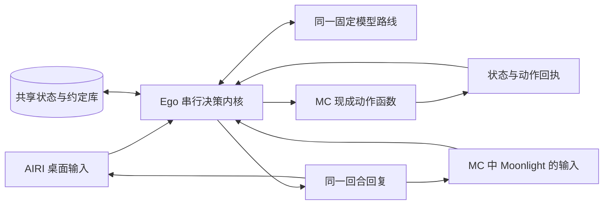

# Ego 共享内核 v1.3

AIRI 桌面与 Minecraft 共用一个 Ego 决策入口、同一份对话、约定、待办和动作回执。当前工程版固定 DeepSeek V4.1 Flash / Wafer；MC 身体没有模型客户端，AIRI 通过本机接口读写这个内核。模型可以替换，状态归 Ego 保存。本版不宣称主观意识或完整学习验收通过。



## 本机启动

先打开现有 AIRI 和 Minecraft Java 1.21.1 服务器，玩家 Moonlight 进入 `127.0.0.1:25565`。在 PowerShell 执行：

```powershell
& 'D:\Project\AIProject\MyProject\Ego_proejct_restart\.publish\EGO\prototypes\sharedfield-desktop\growth\companion\start.ps1'
```

启动后会有独立的“Ego 共享内核”窗口。它不依赖 Codex 工具会话存活；本次最多运行 30 分钟，关闭窗口或“结束本次运行”会清理 MC 身体、接口及消息桥。超过期限后需主动重新启动。

AIRI 使用 **OpenAI Compatible**：Base URL 为 `http://127.0.0.1:18787/v1/`，模型为 `ego-companion`。先确认 Base URL，再点击内核面板“复制本机令牌”，粘贴到该提供方的 API Key 输入框。这里只填本机令牌，云端密钥由内核读取既有本机凭据源并只持于内存。

每次内核重启会换本机令牌。更新后推荐从 AIRI 窗口的 File → Exit 完整退出并重新打开；这条路径已现场验证。设置页验证通过不保证已有聊天客户端已更新，Ctrl+R 也曾未消除主窗口的旧客户端。主窗口菜单的 Refresh 可重新加载主窗口，但聊天显示仍可能需要完整重开。旧 401 与漏显示记录保留在连接修复报告中。

AIRI 重开时，消息桥每隔 5 秒尝试本机重连，兼容只有 error、没有 close 的连接失败；主管结束时停止重连。它不重新调用模型或重放 MC 动作。内核到期后必须重新启动并更新本机令牌，重连不会绕过 30 分钟期限。

## 使用

- AIRI 聊天与 MC 公共聊天/私聊都可输入，MC 只接收 Moonlight 的消息。模型回复使用同一内核结果；游戏回复只私聊 Moonlight。
- 例如教 `「回家暗号」代表「走到我身边」`，随后在另一个入口使用。只有能逐字引用的明确约定才可入库；这是约定接口，不代表 U1 完整学习成绩通过。
- 输入 `停止` 会优先停身体并暂停现有待办，不需要模型调用。面板“停止当前动作”也是紧急物理停止入口。
- 断线后通过“连接 MC”重连，不会自动重放重启前动作。
- MC 回复漏显示时，可按“同步 MC 回复”：读取最后一个已完成 MC 回合，只回显缓存，不再次调用模型或执行游戏动作。面板“AIRI 已连接”只表示消息桥连接，不等于聊天配置已经验收成功。
- 待办会保存；当前是一条活动待办，暂停后等待新输入。尚未证明复杂建房任务能稳定完成，也未实现通用自主任务系统。

## 存储和范围

正式存档：`growth/runs/kernel_v1/owner/state.sqlite`。工程验收存档：`growth/runs/kernel_v1/acceptance/state.sqlite`；启动脚本加 `-Acceptance` 只用于后者。测试约定不复制到正式库；旧 P7 对话也不会自动变成新的权威记忆。AIRI 的界面聊天历史是显示副本，与内核存档分开。

约定更正格式：`触发词不再是旧含义，现在改成新含义`。删除格式：`忘掉触发词`。删除会清除内核来源及派生记录；AIRI 自己的聊天副本仍由 AIRI 保留。

运行日志在 `runs/kernel_v1/sessions/`，均不提交。本批共享原 $5 账本，额外占用上限 $0.50，不释放历史未知预留；固定模型不可用时停止并报告，不悄悄换一个模型完成同一验收。

动作只有观察、接近、跟随、停止、搜索、走近已找到方块、采集、合成、交付、放置的固定函数及参数。每回合最多八次决定、180 秒，每个有限动作最多 60 秒。跟随持续到停止或会话关闭。有合成格/光标残留时拒绝合成；执行失败返回真实回执并暂停。完成搜索但没有找到目标属于观察，可继续做不同查询；通用木材查询覆盖八种官方常见原木，只查询已加载区块，上限 128 格。生成代码执行保持关闭。

本版依赖已审核的 AIRI v0.12.0-beta.5、Mindcraft v0.1.4、Java MC 1.21.1 和既有 growth Python 环境；第三方安装仍在仓库外。AIRI 自带 MC 代理及原 Mindcraft Agent 不与本内核并行运行。语音、读屏和 Crafter 不在本轮范围。

原始接线验收见 `../evidence/kernel_v1/REPORT.md`，搜索修复和三原木实测见 `../evidence/kernel_v1_3/REPORT.md`。离线检查可运行 `python -m unittest companion.test_kernel -v`、`node companion/test_search.mjs` 和 `node companion/test_bridge.mjs`；它们不调用模型或进入游戏。独立搜索验收存档可用 `pythonw -m companion.launcher --acceptance --acceptance-case search-v1.3`，不改原验收或正式存档。

连接恢复报告见 `../evidence/kernel_connection_v1/REPORT.md`；重连回归为 `node companion/test_bridge_reconnect.mjs`，只使用进程内 WebSocket 替身，不联网。
